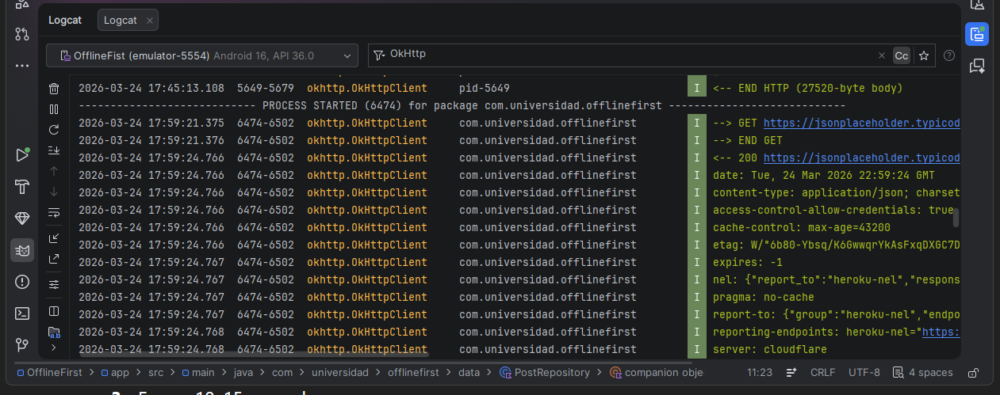
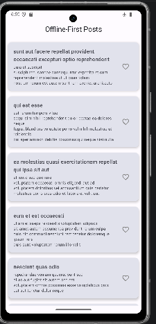

# Offline-First Android App – Posts y Favoritos

## Autor

**Nombre:** Jhoseth Esneider Rozo Carrillo  
**Código:** 02230131027  
**Programa:** Ingeniería de Sistemas  
**Unidad:** Unidad 4 – Modelado de Datos y Persistencia Local
**Actividad:** Post-Contenido 2
**Fecha:** 25/03/2026

## Descripción del Proyecto

Este proyecto consiste en el desarrollo de una aplicación Android que implementa el patrón Offline-First, donde los datos se almacenan localmente utilizando Room y se sincronizan con un servicio remoto mediante el Retrofit y WorkManager.

La aplicación permite:

- Visualizar una lista de posts obtenidos desde una API.
- Persistir los datos localmente.
- Marcar posts como favoritos incluso sin conexión a internet.
- Sincronizar automáticamente los cambios cuando se restablezca la red.

## Arquitectura Implementada

Se utiliza una arquitectura basada en MVVM + Repository Pattern, donde el repositorio actúa como fuente única de verdad, de la siguiente forma:

- UI (Activity/Fragment)
  ↓
- ViewModel
  ↓
- Repository
  ↓
- Room (Local) + Retrofit (Remote)
  ↓
- WorkManager (Sincronización)

## Capas

### data/local

- PostEntity: Modelo de datos para Room
- PostDao: Acceso a la base de datos
- AppDatabase: Configuración de Room

### data/remote

- PostApiService: Endpoints de la API
- PostDto: Modelo de red
- RetrofitClient: Cliente HTTP

### data

- PostRepository:
  Fuente única de verdad
  Implementa lógica de TTL (cache)
  Decide cuándo llamar a red o usar Room

### ui

- PostViewModel:
  Expone datos como Flow
  Maneja lógica de UI

### worker

- SyncFavoritesWorker:
  Sincroniza favoritos pendientes
  Ejecutado con WorkManager

## Tecnologías Utilizadas

- Kotlin
- Android Studio
- Room Database
- Retrofit
- OkHttp Logging
- WorkManager
- Coroutines + Flow

## Capturas del Proyecto

Las siguientes evidencias se encuentran en la carpeta `/evidencias/`:

## Test llamando a PostApiService

## App Posts Offline

## App con llamada a red

## Estado PENDING_SYNC en base de datos

## Estado SYNCED después de sincronización

## App funciona sin red

## WorkManager ejecutado correctamente

## Conclusión

Este proyecto demuestra la implementación de un sistema offline-first, donde la experiencia del usuario no depende de la conectividad, garantizando persistencia, rendimiento y sincronización automática.
